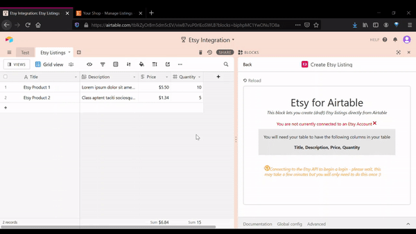

# Airtable Etsy Block

A block to integrate Airtable with Etsy - the block allows a user to create a (draft) Etsy listing directly from an Airtable record

Check this out in action on [Airtable](https://airtable.com/shraTO6yMpDmCAv4D)

## Docs

This is still a WIP so needs a bit of setup

- Have an existing Etsy account and  store
- Need to have set up a shipping template in Etsy (see [here](https://help.etsy.com/hc/en-gb/articles/115014115187-How-to-Set-Postage-Prices-with-Delivery-Profiles?segment=selling))
- Have a table in the base called 'Etsy Listings'
- Have fields with the names - 'Title', 'Description', 'Price', 'Quantity'
